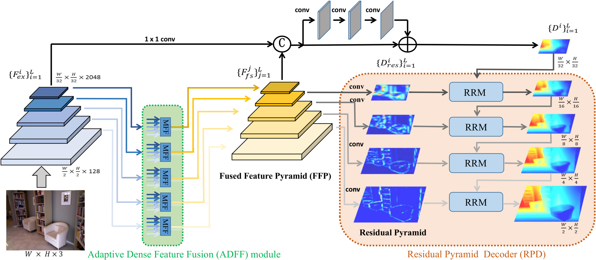

# SARPN:Structure-Aware Residual Pyramid Network for Monocular Depth Estimation
This is the implementation of the paper [***Structure-Aware Residual Pyramid Network for Monocular Depth Estimation***](https://arxiv.org/abs/1907.06023), ***IJCAI 2019, Xiaotian Chen, Xuejin Chen, and Zheng-Jun Zha.***

## Still In Progress

## Introduction
Monocular depth estimation is an essential task for scene understanding. The underlying structure of objects and stuff in a complex scene is critical to recovering accurate and visually-pleasing depth maps. Global structure conveys scene layouts,while local structure reflects shape details. Recently developed approaches based on convolutional neural networks (CNNs) significantly improve the performance of depth estimation. However, few of them take into account multi-scale structures in complex scenes. In this paper, we propose a Structure-Aware Residual Pyramid Network (SARPN) to exploit multi-scale structures for accurate depth prediction. We propose a Residual Pyramid Decoder (RPD) which expresses global scene structure in upper levels to represent layouts, and local structure in lower levels to present shape details. At each level, we propose Residual Refinement Modules (RRM) that predict residual maps to progressively add finer structures on the coarser structure predicted at the upper level. In order to fully exploit multi-scale image features, an Adaptive Dense Feature Fusion (ADFF) module, which adaptively fuses effective features from all scales for inferring structures of each scale, is introduced. 


## If you find this code useful in your research, please cite:

```
@inproceedings{Chen2019structure-aware,
             title = {Structure-Aware Residual Pyramid Network for Monocular Depth Estimation},
             author = {Chen, Xiaotian and Chen , Xuejin and Zha, Zheng-Jun},
	     conference={International Joint Conferences on Artificial Intelligence},
             year = {2019}   
} 
```
