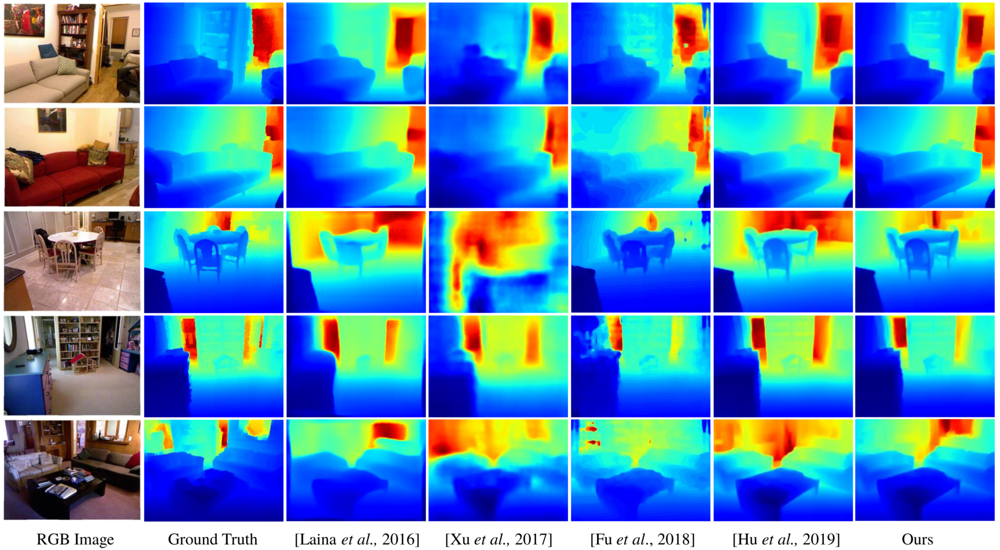

# Structure-Aware Residual Pyramid Network for Monocular Depth Estimation
This is the implementation of the paper [***Structure-Aware Residual Pyramid Network for Monocular Depth Estimation***](https://arxiv.org/abs/1907.06023), ***IJCAI 2019, Xiaotian Chen, Xuejin Chen, and Zheng-Jun Zha.***

## Citation

```
@inproceedings{Chen2019structure-aware,
             title = {Structure-Aware Residual Pyramid Network for Monocular Depth Estimation},
             author = {Chen, Xiaotian and Chen , Xuejin and Zha, Zheng-Jun},
	     conference={International Joint Conferences on Artificial Intelligence},
             year = {2019}   
} 
```
## Contents
1. [Introduction](#introduction)<br>
2. [Usage](#usage)<br>
3. [Results](#Results)<br>
4. [Acknowledgements](#Acknowledgements)<br>

## Introduction
Monocular depth estimation is an essential task for scene understanding. The underlying structure of objects and stuff in a complex scene is critical to recovering accurate and visually-pleasing depth maps. Global structure conveys scene layouts,while local structure reflects shape details. Recently developed approaches based on convolutional neural networks (CNNs) significantly improve the performance of depth estimation. However, few of them take into account multi-scale structures in complex scenes. In this paper, we propose a Structure-Aware Residual Pyramid Network (SARPN) to exploit multi-scale structures for accurate depth prediction. We propose a Residual Pyramid Decoder (RPD) which expresses global scene structure in upper levels to represent layouts, and local structure in lower levels to present shape details. At each level, we propose Residual Refinement Modules (RRM) that predict residual maps to progressively add finer structures on the coarser structure predicted at the upper level. In order to fully exploit multi-scale image features, an Adaptive Dense Feature Fusion (ADFF) module, which adaptively fuses effective features from all scales for inferring structures of each scale, is introduced. 

## Usage
### Dependencies
- [Python3.6](https://www.python.org/downloads/)
- [PyTorch(1.0.1)](https://pytorch.org/)
- [NYU Depth v2](https://cs.nyu.edu/~silberman/datasets/nyu_depth_v2.html)

### Train
As an example, use the following command to train SARPN on NYUDV2.<br>

	CUDA_VISIBLE_DEVICES="0,1,2,3" python train.py --trainlist_path (the path of trainlist(nyu2_train.csv))\
						       --checkpoint_dir (the directory to save the checkpoints)\
						       --root_path (the root path of dataset)\
						       --logdir (the directory to save logs and checkpoints)\
						       --pretrained_dir (the path of pretrained models)\
						       --do_summary
						
### Evaluation
Use the following command to evaluate the trained SARPN on NYUDV2 test data.<br>

	CUDA_VISIBLE_DEVICES="0" python evaluate.py --testlist_path (the path of testlist(nyu2_test.csv))\
						    --root_path (the root path of dataset)\
						    --loadckpt (the path of the loaded model)\
						    --pretrained_dir (the path of pretrained models)\
						    --threshold (threshold of the pixels on edges)

### Pretrained Model
You can download the pretrained model:<br>
[NYUDV2](https://1drv.ms/u/s!AhXIHZfUg-uSaQmwNbyEDywBGMc?e=wjUZwc)
### Pre-processed Data
You can download the pre-processed data from this [link](https://drive.google.com/file/d/1WoOZOBpOWfmwe7bknWS5PMUCLBPFKTOw/view?usp=sharing), which is shared by [Junjie Hu.](https://github.com/JunjH/Revisiting_Single_Depth_Estimation)

## Results


## Acknowledgements
Thanks to Junjie Hu for opening source of his excellent [work](https://arxiv.org/abs/1803.08673). Our work is inspired by this work and part of codes.
	
